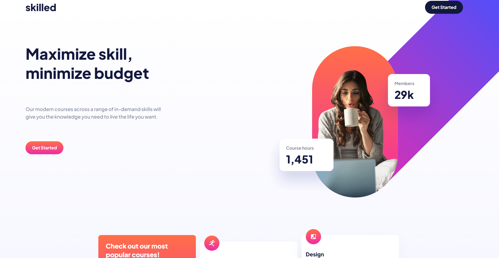
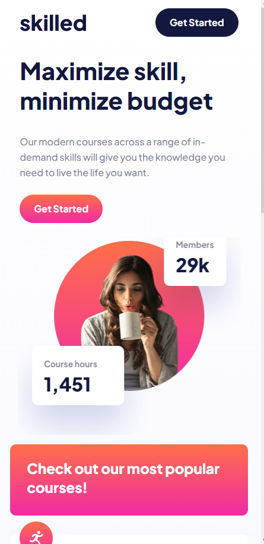

# Kafayat Ige Frontend Mentor - Skilled e-learning landing page solution

This is a solution to the [Skilled e-learning landing page challenge on Frontend Mentor](https://www.frontendmentor.io/challenges/skilled-elearning-landing-page-S1ObDrZ8q). Frontend Mentor challenges help you improve your coding skills by building realistic projects.

## Table of contents

- [Overview](#overview)
  - [The challenge](#the-challenge)
  - [Screenshot](#screenshot)
  - [Links](#links)
- [My process](#my-process)
  - [Built with](#built-with)
  - [Useful resources](#useful-resources)
- [Author](#author)

## Overview

### The challenge

Users should be able to:

- View the optimal layout depending on their device's screen size
- See hover states for interactive elements

### Screenshot

### Links

- Solution URL: [Add solution URL here](https://your-solution-url.com)
- Live Site URL: [Add live site URL here](https://your-live-site-url.com)

## My process

### Built with

- Semantic HTML5 markup
- SCSS
- Flexbox
- CSS Grid
- Mobile-first design

**Note: These are just examples. Delete this note and replace the list above with your own choices**

### What I learned

Using SCSS mixins and setting variables for colors helped organize styling.

**Note: Delete this note and the content within this section and replace with your own plans for continued development.**

### Useful resources

- [How to use SASS](https://www.freecodecamp.org/news/how-to-use-sass-with-css/) 
- [Trekab solution to same project](https://github.com/trekab/skilled-e-learning-landing-page) - This is another solution I read  through when I had challenges with positioning the image for desktop screen. I like how the programmer arranged his code and classes are well named.

## Author
- Frontend Mentor - [@Kafayatige](https://www.frontendmentor.io/profile/Kafayatige)
- Instagram - [@kaffycodes](https://www.instagram.com/kaffycodes)

